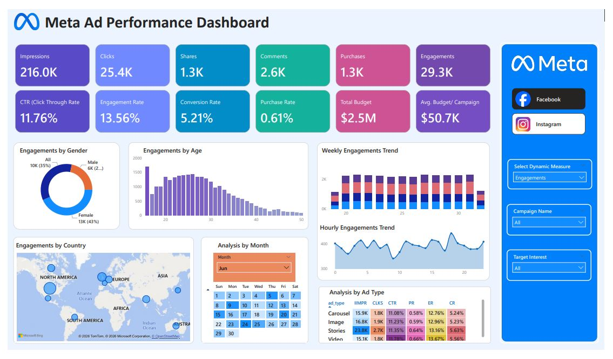
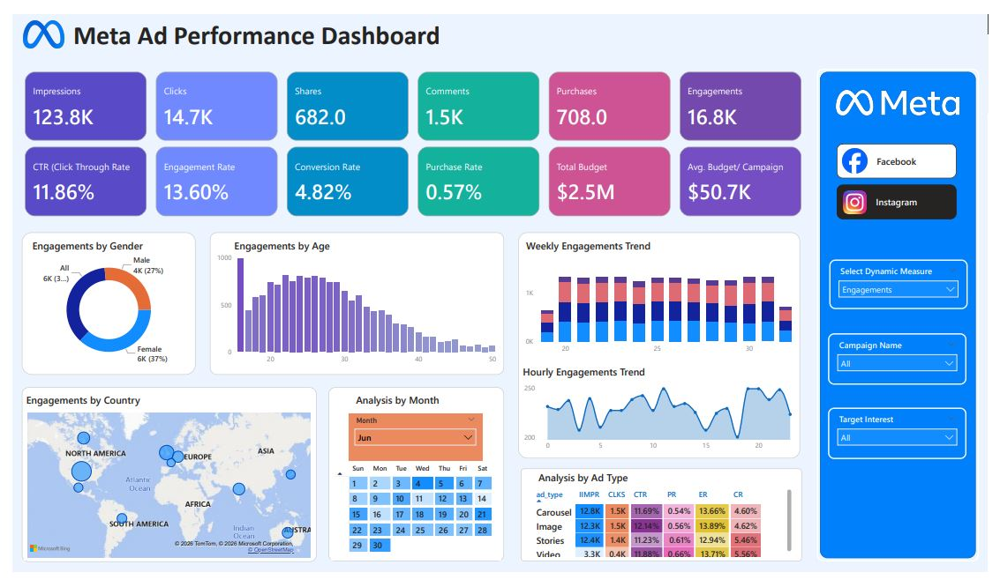

# Meta-Ads-Performance-Analytics-Solution
Meta Ads Performance Analytics Solution is a Power BI dashboard that tracks and optimizes Facebook and Instagram ad campaigns. It visualizes KPIs like impressions, clicks, conversions and budget utilization, offering insights on ad performance, audience trends and seasonal patterns to boost ROI and improve strategy.

## Project Overview
The **Meta Ads Performance Analytics Solution** is a Power BI dashboard that provides deep insights into the performance of Facebook and Instagram advertising campaigns. This project analyzes key metrics such as impressions, clicks, engagements, conversions and budget utilization to help marketers optimize their ad strategies and improve campaign outcomes.

### Business Objective:
The main objective of this project was to create an interactive and visually appealing dashboard that enables marketing teams to:
- Track campaign effectiveness through key performance indicators (KPIs).
- Identify trends in audience engagement, geographic reach and ad performance.
- Optimize budget allocation by analyzing the effectiveness of different ad types (carousel, image, stories, video).
- Evaluate ROI (Return on Investment) and make data-driven decisions for future campaigns.

---

## Dashboard Features

### 1. **Key Performance Indicators (KPIs) Tracked**
The dashboard tracks the following KPIs to evaluate ad performance:

- **Impressions**: The number of times ads were displayed.
- **Clicks**: The number of times users clicked on the ads.
- **Shares**: The number of times users shared the ads, indicating viral engagement.
- **Comments**: The number of comments made on the ads, providing insights into user sentiment and feedback.
- **Purchases (Conversions)**: The number of purchases made after viewing the ads.
- **Engagements**: The total interactions, including clicks, shares and comments.
- **CTR (Click-Through Rate)**: Percentage of impressions that resulted in clicks.
- **Engagement Rate**: Percentage of impressions that resulted in engagement (clicks, shares, comments).
- **Conversion Rate**: Percentage of clicks that resulted in purchases.
- **Purchase Rate**: Percentage of impressions that resulted in purchases.
- **Total Budget**: The total spend on advertising campaigns.
- **Average Budget per Campaign**: The average spend allocated to each campaign.

### 2. **Ad Type Performance**
The dashboard also compares performance across different **ad types**, including:
- **Carousel**: Multi-image ads.
- **Image**: Single-image ads.
- **Stories**: Full-screen ads that disappear after 24 hours.
- **Video**: Ads featuring video content.

### 3. **Audience Demographics**
The dashboard includes detailed audience segmentation by:
- **Gender**: Analyze how different genders engage with the ads.
- **Age Group**: Identify which age groups are most engaged with the ads.
- **Country**: Visualize engagement across different countries, with color-coded maps showing where the majority of interactions are coming from.

**Geographic Distribution**:

**Map Visualizations**: Display performance across regions, with bubble size or color intensity representing key metrics like engagement and impressions.

### 4. **Time-Based Analysis**
The dashboard provides insights into:
- **Weekly Trends**: How engagement varies across the weeks.
- **Hourly Trends**: Peak engagement times throughout the day.
- **Calendar View**: A heat map showing which dates had the highest engagement and other KPI's.

---

## Link to Published Power BI Dashboard
The **Meta Ads Performance Dashboard** is published on **Power BI Web**. You can access and interact with the live dashboard through the following link:

[**Meta Ads Performance Dashboard (Power BI Web)**](https://app.powerbi.com/view?r=eyJrIjoiODI1YWJhMmUtNzE2Yi00NTdkLWI5ZTgtMmQ3ZmZkYTIzODBjIiwidCI6IjBiNzk5OWFlLTgzOWYtNDUzOC1iZDk0LTkzMWMzNDY4NmExYyIsImMiOjEwfQ%3D%3D)

Please note that the link above will redirect you to the interactive Power BI dashboard. You can explore the visualizations and filter data to gain insights into various KPIs, ad performance, and audience behavior.

---

## Dashboard Images
Below is a snapshot of the **Meta Ads Performance Dashboard**:

---

## Visualizations and Their Purpose
### Target Gender – Donut Chart

**Description**: A donut chart visualizing the engagement of ads split by gender.

**Purpose**: To determine which gender (male, female, or others) is more engaged with the ad campaigns.

**Why**: This insight helps target specific gender demographics more effectively.

### Target Age Group – Bar Chart

**Description**: A bar chart displaying engagement across different age groups.

**Purpose**: To identify which age group responds most effectively to the campaigns.

**Why**: Knowing the best-performing age group allows marketers to fine-tune targeting strategies.

### Country – Map Visualization

**Description**: A map that visualizes campaign performance by country, with varying bubble sizes or colors to represent key metrics.

**Purpose**: To understand which regions or countries provide the highest engagement.

**Why**: Helps marketers focus on high-engagement areas while also targeting premium markets with stronger purchasing power.

### Calendar Month – Calendar Heat Map

**Description**: A calendar heat map plotting performance on a monthly level based on event timestamps.

**Purpose**: To detect seasonal trends and identify peak ad months.

**Why**: This feature helps track the impact of promotions and plan future campaigns accordingly.

### Weekly Trend – Stacked Column by Ad Type

**Description**: A stacked column chart showing weekly performance trends, broken down by ad type.

**Purpose**: To compare the performance of different ad formats (video, stories, image, etc.) over time.

**Why**: Identifying the best-performing ad types by week enables budget reallocation toward high-performing formats.

### Hourly Trend – Area Chart

**Description**: An area chart showing engagement by hour of the day.

**Purpose**: To identify when user activity is highest and lowest throughout the day.

**Why**: Optimizes the timing of ad deliveries, focusing on peak hours for maximum impact.

### Ad Type – Matrix

**Description**: A matrix visualization comparing ad types (carousel, image, stories, video) and possibly further breaking it down by platform (Facebook vs. Instagram).

**Purpose**: To compare ad performance across different formats and platforms.

**Why**: Helps identify which ad types work best on each platform, guiding marketers to optimize their campaigns.

# Insights and Recommendations

Based on the analysis performed through the dashboard, the following recommendations are provided for optimizing Meta ads:

1. **Strong Awareness but Low Conversion**:
   - **Problem**: High CTR and engagement rates suggest the ad creatives are working well, but the conversion funnel is weak.
   - **Solution**: Focus on optimizing the landing pages, offers and retargeting strategies to convert more clicks into purchases.

2. **Target Audience**:
   - **Problem**: Engagement is higher among **females aged 18–30**, but conversions are lower.
   - **Solution**: Tailor campaigns specifically for this audience and refine targeting to maximize conversions.

3. **Best Ad Formats**:
   - **Problem**: Video ads show the highest CTR, CR, and engagement rate, while image and carousel ads have lower performance.
   - **Solution**: Allocate more budget towards video and stories ads to maximize ROI.

4. **Time-Based Optimization**:
   - **Problem**: Engagement peaks in the late afternoon and evening, while early morning shows lower engagement.
   - **Solution**: Schedule ads to run during peak hours (afternoon and evening) to maximize user interaction.

---

## Future Work and Improvements

- **Incorporating Machine Learning Models**: Future iterations of this dashboard could incorporate predictive models to forecast campaign performance based on historical data.
- **Real-time Data Integration**: The dashboard could be further enhanced by integrating real-time data through APIs to track live ad performance.

---

## Conclusion

This **Meta Ads Performance Analytics Solution** provides comprehensive insights into ad campaign performance, helping marketing teams make data-driven decisions for better ROI. With detailed visualizations and interactive filters, the dashboard makes it easy to monitor campaigns, understand audience engagement and optimize ad strategies.

